# Azure Virtual Network Manager (AVNM) IP Address Management (IPAM) Solution and Azure Landing Zones: One Approach...

This project provides an Azure Bicep template solution for deploying Azure Virtual Network Manager with hierarchical IP Address Management (IPAM) pools. The solution is specifically designed to align with Azure Landing Zone architectures, providing automated IP address planning and allocation across multiple regions while supporting the platform and application landing zone patterns.

> **Note**: This solution represents a suggested approach for implementing IPAM within Azure Landing Zones. There are multiple ways to design and implement IP address management in Azure, and this template provides one opinionated solution. Organizations should evaluate their specific requirements and adapt the approach as needed for their environment.

## 🎯 What's This All About?

Welcome, fellow cloud architect! 🏗️ This repository is your playground for exploring Azure IPAM in a structured, Landing Zone-friendly way. Think of it as:

- 📚 **A learning lab** - Dive into the code, break it, fix it, make it your own!
- 🎨 **An inspiration canvas** - Use these patterns as a starting point for your own IPAM masterpiece
- 🧪 **A reference cookbook** - Copy, paste, modify, and season to taste for your organization's needs
- 🎪 **A fun experiment** - Because who said IP address management can't be enjoyable?

Whether you're a seasoned Azure veteran or just starting your cloud journey, feel free to poke around, ask questions, and most importantly - have fun with it! The best way to learn is by doing, so clone it, deploy it, and see what happens. 🚀

*Remember: The cloud is your oyster, and IP addresses are the pearls! 🦪✨*


## 🏗️ Architecture Overview

The solution creates a hierarchical IPAM structure:

```mermaid
graph TD
    A[Root IPAM Pool<br/>Azure CIDR Block<br/>172.16.0.0/12] --> B[Regional Pool - North Europe<br/>172.16.0.0/16]
    A --> C[Regional Pool - West Europe<br/>172.17.0.0/16]
    A --> D[Regional Pool - Other Regions<br/>172.x.0.0/16]
    
    B --> E[Platform Landing Zones<br/>26 × /24 subnets<br/>10% allocation]
    B --> F[Application Landing Zones<br/>230 × /24 subnets<br/>90% allocation]
    
    E --> G[Connectivity LZ<br/>13 × /24 subnets<br/>50% of platform]
    E --> H[Identity LZ<br/>13 × /24 subnets<br/>50% of platform]
    
    F --> I[Corp LZ<br/>173 × /24 subnets<br/>75% of application]
    F --> J[Online LZ<br/>57 × /24 subnets<br/>25% of application]
    
    style A fill:#2563eb,stroke:#1e40af,stroke-width:2px,color:#ffffff
    style B fill:#7c3aed,stroke:#5b21b6,stroke-width:2px,color:#ffffff
    style C fill:#7c3aed,stroke:#5b21b6,stroke-width:2px,color:#ffffff
    style D fill:#7c3aed,stroke:#5b21b6,stroke-width:2px,color:#ffffff
    style E fill:#dc2626,stroke:#991b1b,stroke-width:2px,color:#ffffff
    style F fill:#059669,stroke:#047857,stroke-width:2px,color:#ffffff
    style G fill:#ea580c,stroke:#c2410c,stroke-width:2px,color:#ffffff
    style H fill:#ea580c,stroke:#c2410c,stroke-width:2px,color:#ffffff
    style I fill:#16a34a,stroke:#15803d,stroke-width:2px,color:#ffffff
    style J fill:#16a34a,stroke:#15803d,stroke-width:2px,color:#ffffff
```



**Text Representation:**
```
Root IPAM Pool (Azure CIDR Block)
└── Regional IPAM Pools (per region)
    ├── Platform Landing Zone Pool
    │   ├── Connectivity Landing Zone Pool
    │   └── Identity Landing Zone Pool
    └── Application Landing Zone Pool
        ├── Corp Landing Zone Pool
        └── Online Landing Zone Pool
```

## 📋 Features

- **Multi-region support**: Automatically creates IPAM pools for multiple Azure regions
- **Hierarchical IP management**: Implements a structured approach to IP allocation
- **Azure Landing Zone alignment**: Supports platform and application landing zone patterns
- **Percentage-based allocation**: Flexible CIDR allocation using configurable percentage factors
- **Automated subnet calculation**: Uses Azure Bicep CIDR functions for automatic IP allocation
- **Dynamic sizing**: Adapts to different region CIDR sizes automatically

## 🚀 Quick Start

### Prerequisites

- Azure subscription with appropriate permissions
- Azure CLI or Azure PowerShell
- Bicep CLI (latest version)

### Deployment

1. **Clone the repository**
   ```bash
   git clone <repository-url>
   cd Azure-AVNM-IPAM
   ```

2. **Deploy the solution**
   ```bash
   az deployment group create \
     --resource-group <your-resource-group> \
     --template-file main.bicep \
     --parameters @parameters.json
   ```

   Or using Azure PowerShell:
   ```powershell
   New-AzResourceGroupDeployment `
     -ResourceGroupName "<your-resource-group>" `
     -TemplateFile "main.bicep" `
     -TemplateParameterFile "parameters.json"
   ```

## ⚙️ Configuration

### Main Parameters

The solution uses strongly-typed parameters defined in `types.bicep`:

| Parameter  | Type           | Description                                |
| ---------- | -------------- | ------------------------------------------ |
| `location` | string         | Azure region for AVNM deployment           |
| `ipam`     | `_environment` | IPAM environment configuration (see below) |
| `regions`  | `_regions`     | Array of regions to deploy (see below)     |

#### IPAM Environment Configuration (`_environment`)

```bicep
param ipam _environment = {
  avnm: {
    name: 'avnm01'                                    // Name of the Azure Virtual Network Manager
    subscriptioNScopes: [subscription().id]          // Subscriptions in AVNM scope
    managementGroupScopes: []                         // Management groups in AVNM scope (optional)
  }
  settings: {
    rootIPAMpoolName: 'AzureGlobal'                  // Display name for root IPAM pool
    AzureCIDR: '172.16.0.0/12'                       // Root Azure CIDR block
    RegionCIDRsize: 16                               // Subnet size for regional pools
    RegionCIDRsplitSize: 24                          // Target CIDR size for subdivision (8-32)
  }
}
```

#### Regions Configuration (`_regions`)

```bicep
param regions _regions = [
  {
    name: 'northeurope'                              // Azure region name
    displayName: 'North Europe'                     // Human-readable display name
    PlatformAndApplicationSplitFactor: 10           // % allocated to platform (0-100)
    ConnectivityAndIdentitySplitFactor: 50          // % of platform to connectivity (0-100)
    CorpAndOnlineSplitFactor: 75                    // % of application to corp (0-100)
    cidr: cidrSubnet(ipam.settings.AzureCIDR, ipam.settings.RegionCIDRsize, 0)  // Auto-calculated CIDR
  }
  {
    name: 'westeurope'
    displayName: 'West Europe'
    PlatformAndApplicationSplitFactor: 10
    ConnectivityAndIdentitySplitFactor: 50
    CorpAndOnlineSplitFactor: 75
    cidr: cidrSubnet(ipam.settings.AzureCIDR, ipam.settings.RegionCIDRsize, 1)
  }
]
```

### CIDR Allocation Example

With default settings:
- **Root CIDR**: `172.16.0.0/12` (172.16.0.0 - 172.31.255.255)
- **Region 1**: `172.16.0.0/16` (North Europe)
- **Region 2**: `172.17.0.0/16` (West Europe)

For each region with `/24` subdivision and `10%` platform allocation:
- **Total /24 subnets available**: 256 (from /16 to /24)
- **Platform allocation**: 26 subnets (10% of 256)
- **Application allocation**: 230 subnets (90% of 256)

**Platform Landing Zones** (with 50% connectivity split):
- **Connectivity**: 13 /24 subnets
- **Identity**: 13 /24 subnets

**Application Landing Zones** (with 75% corp split):
- **Corp**: 173 /24 subnets (75% of 230)
- **Online**: 57 /24 subnets (25% of 230)

## 📁 Project Structure

```
├── main.bicep              # Main template with AVNM and root IPAM pool
├── ipamPerRegion.bicep     # Module for regional IPAM pool hierarchy
├── README.md               # This file
└── LICENSE                 # License file
```

## 🔧 Customization

### Adding More Regions

Add new regions to the `regions` parameter array:

```bicep
param regions _regions = [
  // ...existing regions...
  {
    name: 'eastus'
    displayName: 'East US'
    PlatformAndApplicationSplitFactor: 15
    ConnectivityAndIdentitySplitFactor: 60
    CorpAndOnlineSplitFactor: 80
    cidr: cidrSubnet(ipam.settings.AzureCIDR, ipam.settings.RegionCIDRsize, 2)
  }
]
```

### Modifying IPAM Environment Settings

Adjust the IPAM environment configuration:

```bicep
param ipam _environment = {
  avnm: {
    name: 'myCustomAVNM'
    subscriptioNScopes: [subscription().id, '<additional-subscription-id>']
    managementGroupScopes: ['<management-group-id>']
  }
  settings: {
    rootIPAMpoolName: 'GlobalIP'
    AzureCIDR: '10.0.0.0/8'                          // Different CIDR range
    RegionCIDRsize: 14                               // Larger regional pools (/14 instead of /16)
    RegionCIDRsplitSize: 22                          // Different subdivision granularity
  }
}
```

### Modifying Regional Allocation Factors

Adjust percentage factors per region for different allocation strategies:

```bicep
param regions _regions = [
  {
    name: 'northeurope'
    displayName: 'North Europe - Production'
    PlatformAndApplicationSplitFactor: 20           // More platform resources
    ConnectivityAndIdentitySplitFactor: 30          // More identity resources
    CorpAndOnlineSplitFactor: 90                    // Mostly corporate workloads
    cidr: cidrSubnet(ipam.settings.AzureCIDR, ipam.settings.RegionCIDRsize, 0)
  }
  {
    name: 'westeurope'
    displayName: 'West Europe - Development'
    PlatformAndApplicationSplitFactor: 5            // Minimal platform
    ConnectivityAndIdentitySplitFactor: 50          // Balanced connectivity/identity
    CorpAndOnlineSplitFactor: 20                    // Mostly online/external workloads
    cidr: cidrSubnet(ipam.settings.AzureCIDR, ipam.settings.RegionCIDRsize, 1)
  }
]
```

### Type Validation Benefits

The typed parameters provide several advantages:

- **Compile-time validation**: Invalid configurations are caught during Bicep compilation
- **IntelliSense support**: Better development experience with auto-completion
- **Range validation**: Percentage factors are automatically validated (0-100)
- **CIDR size validation**: RegionCIDRsplitSize is validated (8-32)
- **Documentation**: Type definitions serve as living documentation

## 🔍 Monitoring and Management

After deployment, you can:

1. **View IPAM pools** in the Azure portal under Network Manager
2. **Monitor IP allocation** through Azure Monitor
3. **Manage pool hierarchy** using Azure CLI or PowerShell

### Useful Commands

```bash
# List IPAM pools
az network manager ipam-pool list --network-manager-name <avnm-name> --resource-group <rg-name>

# Show specific pool details
az network manager ipam-pool show --name <pool-name> --network-manager-name <avnm-name> --resource-group <rg-name>
```

## 🛡️ Security Considerations

- AVNM requires appropriate RBAC permissions
- Consider network security groups and Azure Firewall integration
- Implement proper access controls for IPAM pool management

## 🤝 Contributing

1. Fork the repository
2. Create a feature branch
3. Make your changes
4. Test thoroughly
5. Submit a pull request

## 📝 License

This project is licensed under the MIT License - see the [LICENSE](LICENSE) file for details.

## 📚 Additional Resources

- [Azure Virtual Network Manager Documentation](https://docs.microsoft.com/azure/virtual-network-manager/)
- [Azure IPAM Documentation](https://docs.microsoft.com/azure/virtual-network-manager/concept-ip-address-management)
- [Azure Landing Zone Architecture](https://docs.microsoft.com/azure/cloud-adoption-framework/ready/landing-zone/)
- [Bicep Documentation](https://docs.microsoft.com/azure/azure-resource-manager/bicep/)

## 🐛 Troubleshooting

### Common Issues

1. **Insufficient permissions**: Ensure the deployment principal has Network Contributor role
2. **CIDR conflicts**: Verify that your CIDR blocks don't overlap with existing networks
3. **Region availability**: Confirm that AVNM is available in your target regions

### Support

For issues and questions:
1. Check the [Issues](../../issues) section
2. Review Azure documentation
3. Contact your Azure support team for deployment-specific issues

## 💡 Key Concepts

### Percentage-Based Allocation

The solution uses three percentage factors to dynamically allocate CIDR blocks:

1. **PlatformAndApplicationSplitFactor**: Determines what percentage of the region's subdivided CIDRs go to platform vs application landing zones (0-100%)
2. **ConnectivityAndIdentitySplitFactor**: Within platform, determines the split between connectivity and identity landing zones (0-100%)
3. **CorpAndOnlineSplitFactor**: Within application, determines the split between corporate and online landing zones (0-100%)

### Dynamic Subdivision

- The `RegionCIDRsplitSize` parameter controls the granularity of CIDR subdivision (valid range: 8-32)
- For example, with a `/16` region CIDR and `RegionCIDRsplitSize` of `24`, you get 256 `/24` subnets to allocate
- These subnets are then distributed based on the percentage factors
- Percentage factors can range from 0-100, allowing for flexible allocation including 0% allocation to any category

### Hierarchical Structure

Each level in the IPAM hierarchy can contain multiple CIDR blocks, providing flexibility and efficient IP space utilization:
- Regional pools contain the full regional CIDR
- Platform/Application pools contain arrays of allocated subnets
- Landing zone pools contain their respective allocated subnets
